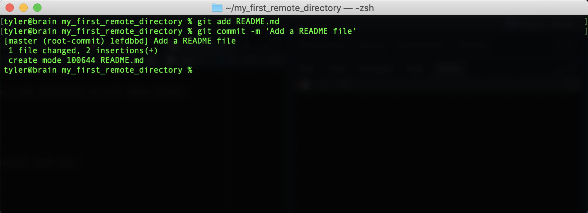
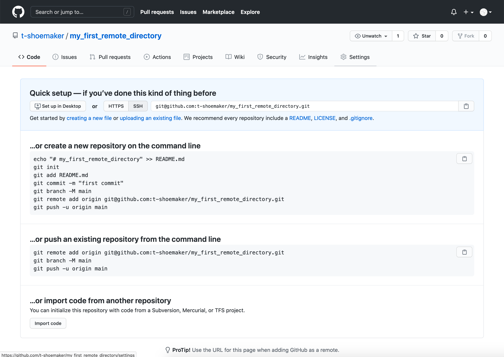
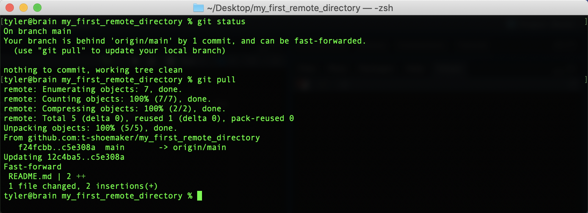
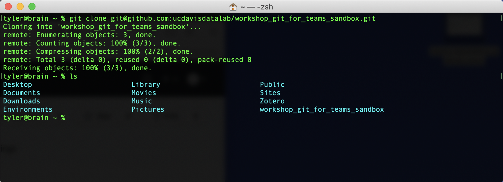
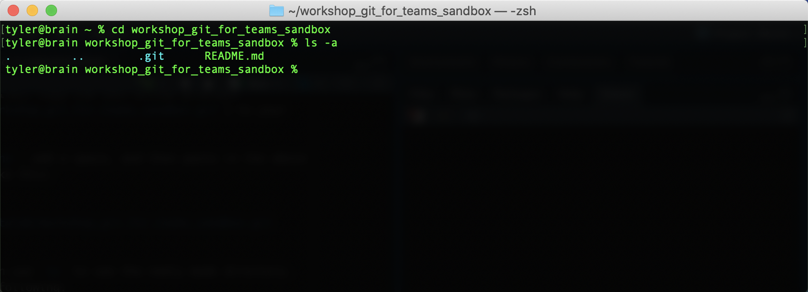

# Working with Remote Repositories

One of the advantages of working with a version control system like Git is the ability to maintain and sync repositories across multiple computers and users.  While there a variety of available, internet accesible remote repository hosting options, in this course, we will work with the [Github](https://github.com/) platform. 

## GitHub Basics


At its simplest, GitHub is a hosting service for Git repositories. Much like 
Dropbox or Google Drive, it gives you a space to remotely store your code and 
related files. This can be useful when working on projects that require, for 
example, some kind of server, whether for the purposes of running large, 
potentially time-consuming data analyses or for serving up public-facing content 
(like a website). For such projects, GitHub acts as a reference point with which 
you can add, or **push**, changes on one computer and bring them down, or 
**pull** them, onto another. The process would look something like the following, 
where pushing and pulling from a remote branch entails keeping a reference point 
for a project that you're developing locally:


<center>
[Image source.](https://www.reddit.com/r/git/comments/99ul9f/git_workflow_diagram_showcasing_the_role_of/)
</center><br>

With this diagram in mind, it's not much of a conceptual leap to imagine how two 
or more people could work from the same remote repository. Each would pull that 
repository onto their respective local computers, make a branch, implement their 
changes, and push those changes back to the remote source. That way, multiple 
parts of a project could be under development simultaneously, and any such 
changes made to that project would be trackable according to the logic of version 
control.

Simultaneously pushing and pulling on multiple computers would look something 
like the following:


<center>
[Image source.](https://gist.github.com/fentontaylor/c6110b2e20e29a656645ce03d1848964)
</center>

### Communicating Through GitHub


What makes GitHub special is the fact that, more than being 
simply a place to store files, the service is above all a _communication channel_. 
Where GitHub extends the functionality of version control is not just where it 
offers various forms of cloud hosting; it is also where GitHub provides tools 
that let people talk about the code they're working on. It's a place where team 
members can propose and explain the changes they make, look at changes others 
have made, track and discuss any bugs that might come up, get feedback from 
others, and plan for any future changes the team intends to make.

Learning how to use GitHub, then, is as much about learning how to communicate 
effectively through the different facets of the service as it is about 
acquainting yourself with new technical skills (i.e., using your computer to 
track code remotely). 

A short summary of the different facets of communication GitHub provides 
includes:

* Documentation, often through README files
* Issue tracking for bug reporting and assigning tasks
* Pull requests for proposing and discussing changes
* Wikis, which may feature additional documentation, tutorials, etc.
* Project boards for long-term planning
* Various graph visualizations for project overview

Additionally, GitHub users can monitor and modify other projects' code using 
"Watch", "Star", and "Fork" functionalities. The service also provides teams 
with the ability to specify licensing information for their projects.

### What Should I Push to GitHub?


A quick word about what should and shouldn't be pushed to a remote repository, 
especially with an eye toward what we've said about communication. You can, of 
course, host large data files on GitHub, but there are a few caveats. For one, 
the site does have a storage limit, and it can also become quite inefficient to 
have team members constantly push/pull large files to/from GitHub. Further, 
hosting data files might not be particularly relevant to what a team might need 
to discuss. Data may change often over the course of a project, but tracking 
individual observations might not be necessary---more meaningful would be a 
conversation about how code has made, or might make, such changes. The latter 
is likely to be something that GitHub is better suited to facilitate.

It's best, then, to host your data files separately from GitHub, either by way 
of a remote database or some kind of cloud service like Google Drive. Exceptions 
may come up, however, so the decision about what to track should ultimately be 
one made by the team.

Examples of what should be tracked with GitHub:

* Code
* Documentation
* Make files
* Some supporting media (small images, for example)

Finally, note that even though you can set a repository to either "Public" or 
"Private" (which controls who can see your project), it's recommended that you 
refrain from uploading various access credentials (API keys, database passwords, 
etc.) to GitHub.


## Basic GitHub Account Setup


To use GitHub, you need to make a (free) account. You can do so by going to 
[github.com](https://github.com/). Once you're there, click "Sign Up" in the 
top-right corner of the page. This should take you to a form, which asks you to 
enter a **username**, **email address**, and **password**. After you've entered 
in this information (and completed a quick CAPTCHA), GitHub will make you an 
account. Then, the site will prompt you to complete an optional survey. Fill it 
out, or scroll to the bottom to skip it.

Either way, you'll need to then verify your email address. Go to your inbox and 
look for an email from GitHub. Click the "Verify email address" button. Doing so 
will take you to your homepage, where, if you'd like, you can add a few details 
about yourself.


You now have a GitHub account!

### Locally Setting Up Your Git Credentials

Regardless of how you make your commits, you will need to use the command line 
to provide Git with some information about who will be making commits. You 
may have already done this, however (and sometimes your computer does it
automatically). To check, enter the following two commands in either Terminal 
(Mac) or Git Bash (Windows):

```
git config --global user.name
git config --global user.email
```

If you see your name (or some kind of username) and your email after entering 
the above commands, you're set. If nothing happens when you type them, you'll 
need to provide this information with the following:

```
git config --global user.name "<your name>"
git config --global user.email "<your email>"
```

You can check whether this was successful by simply calling either, or both, of 
the first two commands. They should echo back the information you've just 
entered.


### SSH Keys and GitHub

When you work with remote repositories on GitHub, you'll often need to enter 
your username/password to identify yourself. This is for two reasons: 1) it 
allows GitHub to track who has made changes to what files; 2) it adds a layer 
of security to projects, letting teams control who can make changes to their 
files. Repositories can be either public or private, and this layer of security 
helps teams control who has access to files in the first place.

It can be a pain, though, to have to enter and re-enter your credentials when 
making changes. More, passwords can be lost or worse, stolen. To avoid these 
problems, we can set up an **SSH key**. SSH keys (short for "Secure Shell") 
are special, machine-readable credentials that allow users to safely connect 
and authenticate with remote servers over unsecure networks.

An SSH key has two parts: 

1. A _public key_, which encrypts messages intended for a particular recipient. 
This can be stored on remote servers, or even shared with others, to facilitate 
secure data transfers
2. A _private key_, which deciphers messages encrypted by the public key. Your 
private key is the only thing capable of unlocking what is sent with your public 
key. It stays on your computer and should never be shared with anyone

Beyond what security measures an SSH key brings, it also acts as your digital 
signature. GitHub uses this internally to verify that you are, in fact, who 
you say you are when you commit code to a repository.

### Connecting to GitHub with SSH

GitHub offers thorough, straightforward documentation for setting up an SSH key 
with its services, which we won't repeat here. Instead, please visit the link 
below and follow the step-by-step instructions there to get yourself set up 
with a key.

[Connecting to GitHub with SSH](https://docs.github.com/en/github/authenticating-to-github/connecting-to-github-with-ssh)

The following steps at the link above are required:

* Checking for existing SSH keys
* Generating a new SSH key and adding it to the ssh-agent
* Adding a new SSH key to your GitHub account
* Testing your SSH connection

Once you have completed these steps, be sure you can successfully run the 
following command: 

```
ssh -T git@github.com
```

If your connection is successful, you will see this message (a warning may first 
appear---see the documentation on GitHub for more information):

```
Hi <your username>! You've successfully authenticated, but GitHub does not 
provide shell access.
```
## GitHub Desktop, or the Command Line?

Remember that Git is separate from GitHub. The latter is a service that's been 
built around the former. One part of the services that GitHub offers is an 
application called [GitHub Desktop](https://desktop.github.com/), which allows 
users to manage their local repositories with a point-and-click graphical user 
interface (or GUI). Ultimately, it's a matter of preference whether you use the 
GUI or stick with the command line for your own projects, but it is generally a good idea to become proficent at interacting with GitHub via the command line. One of the primary 
reasons for this has to do with the fact that not every computer you use will 
have GitHub's GUI installed---or even have a screen! Many remote servers offer 
command line-only access, and if you ever want to sync your files with these 
machines, you'll need to do so without GitHub Desktop. Luckily, GitHub 
seamlessly extends Git commands, so using the service without the GUI is, as 
we'll see, quite straightforward.


## Sync with GitHub

Now that you're all set up with GitHub, it's time to sync the website with a 
local repository on your computer.  We'll start by creating a test repository on your local Git intance.


First, use the command line to make a new directory in your Home folder:

```
mkdir ~/my_first_remote_directory
```

Put this directory under version control with Git:

```
cd ~/my_first_remote_directory
git init
```

With Vim, make a README markdown file:

```
vim README.md
```

Write and save "Hello world!" in the file. You should see something like the 
following:


Exit Vim. Then, add README.md to Git and commit your changes. Don't forget to 
write a short note in the commit message.

```
git add README.md
git commit -m 'Add a README file'
```

You should see the following:



### Preparing to Sync Your Repository

So far so good! All we've done is repeat the normal workflow for putting files 
under version control. But now we need to step away from the command line for 
a moment and prepare a space for receiving this repository on GitHub.

To do so, go to github.com and, on your homepage, click the "Create repository" 
button. You'll be taken to this page:


There are a few things of note here:

* Repository name: your repository's name, which should be the same as what's on your computer
* Description: a short (1-2 sentence) explanation of what's in this repository
* Public/private setting: repositories may be either "public" (viewable by anyone) or "private" (only viewable by you and those to whom you grant access)
* Initialize with details, including:
  * A README file: a form of documentation; provides information about the files in the repository
  * A .gitignore file: instructs Git to ignore specific files or filetypes
  * A license: governs the use or redistribution of your files
  
Because we're initializing this repository from an existing directory, we won't 
bother with most of the extra details. But we do need a title, which should be 
the same as what's on your local computer ("my_first_remote_directory"). A 
description is helpful but not necessary for our purposes; the same goes for a 
license. Finally, we will choose to make this a public repository (meaning 
anyone can see it).


### Pushing a Local Repository

Once you've entered the above information, click "Create repository." GitHub 
will take you to a new screen, which gives you a number of options for making or 
uploading new files to the repository.



Since we already have a repository made, we need to use the "Push an existing 
repository from the command line." Pushing our repository is as easy as 
sequentially entering into the command line the three commands GitHub provides.

```
git remote add origin git@github.com:<your user account>/my_first_remote_directory.git
git branch -M main
git push -u origin
```

On the command line, that looks like this:


To summarize the above, we've done the following:

1. Associated GitHub's remote repository with our local repository (`git remote` etc.)
2. Made a new branch in our local repository called "main" (`git branch -M main`)
3. Pushed the contents of main (from `origin`) to a new, corresponding remote branch on GitHub

From here on out, when you want to update the remote repository with further 
changes, you can simply use the shorthand `git push` after the usual save, add, 
commit steps. Importantly, Git will only update the branch you're on when you 
enter `git push`, so before making any pushes, it's a good idea to run a quick 
`git status` command to make sure you're on the branch you want to be on.

When you make your changes, the GitHub site won't immediately refresh itself, 
but if you click on the "< > Code" tab or on the name of the directory, you'll 
see that the repository has been synced and your README.md file is now online.


Note that GitHub automatically looks for a README file in your repository. If it 
finds one that contains renderable [markdown](https://guides.github.com/features/mastering-markdown/) code, it will 
render the file on your repository's main page. (More information about writing 
effective README files is available through the DataLab's data documentation 
[workshop](https://ucdavisdatalab.github.io/workshop_how-to-data-documentation/).)

### Tracking Files Remotely

With this repository made, GitHub can start tracking changes you make to your 
files, much as Git does locally. The process works exactly like the one you 
do for Git, though it requires one more step.

First, we'll alter our README.md. Reopen the file with vim, skip a line down 
from the line you've already written, and add "My name is <your name>." Save and 
quit.


Then, add the file and commit your changes.


If you want to push these changes to your remote repository, simply enter `git push`. 
You'll see a similar message appear about enumerating, counting, and writing 
objects to GitHub. Afterwards, if you refresh your file on GitHub, you should 
see your changes:


Note that your commit message appears here as well:


If you click the commit tag:


You'll be taken to another page, which shows you the differences between your 
old version and the new one:


### Pulling Changes from a Remote Repository

Before moving on, it's also worth noting that we can pull changes directly from 
GitHub. If a file has been altered on the remote version of a project, GitHub 
offers functionality for syncing that file with your local copy (or creating a 
new file altogether, if need be).

For example, if you return to the main page of "my_first_remote_directory", you 
can alter the README directly on GitHub. Click the pencil in the right-hand 
corner of the rendered file.


This will open up a text editor interface. Using it, add "What's yours?" on the 
fifth line of the document. The complete document should look like this:

```
Hello world!

My name is <your name>

What's yours?
```

Scroll to the bottom and click the green "Commit changes" button. This is the 
equivalent of doing `git add <file>` and `git commit -m <message>` on the 
command line.

You'll see something like the following:


Back on the command line, if you type `git status`, you'll see that your local 
repository is now out of sync.


If you haven't made any changes to your directory, syncing it with the remote 
version can be achieved with a straighforward pull command:

```
git pull
```

Once you enter this command, your command line should look something like this:



Your files are now synced. A later portion of this reader will discuss how to 
handle this process when you _have_ made changes to your directory between the 
time the remote was altered and the time you go to make a pull.

## Cloning a Repository


While tracking your own files remotely with GitHub is great for managing and 
storing your files, this doesn't quite tap into the full use of the service. 
Remember, GitHub is above all a communication channel, in which people can share 
and discuss the code/files they're working on. We haven't yet taken advantage of 
much of what makes GitHub useful: getting files for a project, modifying them, 
discussing the changes with team members, and implementing those changes.

### How to Clone a Repository

To start using GitHub collaboratively, we need to retrieve, or **clone**, a 
repository. This will create a local copy of project files.

First, go back to your Home directory. You'll be putting a repository here (in 
command line speak, the repository will be a "child" of Home).

```
cd ~
```

Then, go to the following link: [https://github.com/ucdavis-datalab-training/workshop_git_for_teams_sandbox](https://github.com/ucdavis-datalab-training/workshop_git_for_teams_sandbox)

Once there, click on the green "Code" button, which should show the following:


Since you have SSH keys, select the "SSH" option. Copy the text GitHub provides 
to your clipboard. Then, in the command line, type `git clone`, add a space, 
and paste in the line of text GitHub generated for you. The full command should 
look like this:

```
git clone git@github.com:ucdavis-datalab-training/workshop_git_for_teams_sandbox.git
```

Hit "Enter". If you'd like, you can use `ls` to see the newly made directory. 
You should see something like the following:



If you `cd` into the directory and then type `ls -a`, you'll see a README.md 
file and a .git file, which contains all the logging info for the repository.

