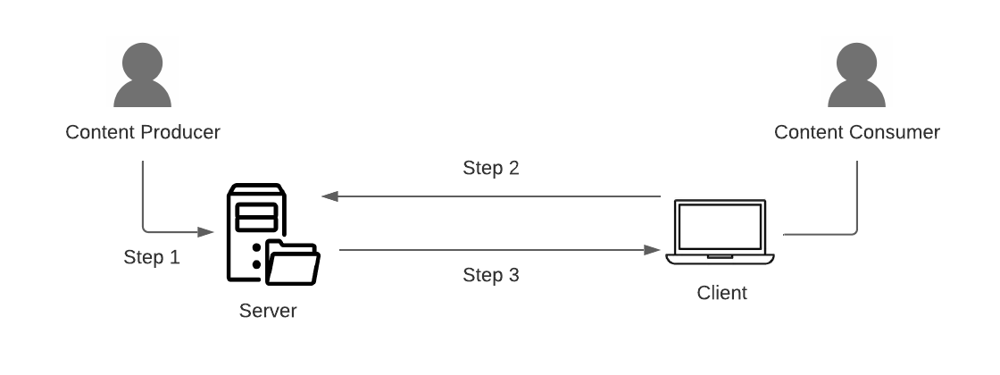

# How the Web Works

The discipline of Data Science was, in a large part, ushered into being by the increasing availability of information available on the World Wide Web or through other internet sources. Prior to the popularization of the internet as a publishing and communications platform, the majority of scientific research involved controlled studies in which researchers would collect their own data through various direct means of data collection (surveys, medical testing, etc.) in order to test a stated hypothesis.

The vast amount of information available on the internet disrupted this centuries long dominance. Today, the dominant form of scientific research involves using data collected or produced by others for reasons having little or nothing to do with the research question being investigated by scholar. Users who post items about their favorite political candidate are not, for example, doing this so that sociologists can better under how politics function in America. However, their Tweets are being used in that and many other unforseen capacities.

Because the internet provides such a rich trove of information for study, understanding how to effectively get, process, and prepare information from the internet for scientific research is a crucial skill for any data scientist. And in order to understand these workflows, the data scientist must first understand how the internet itself functions.

## Client-Server Architecture

The base architecture and functioning of the internet is quite simple:



1. A content producer puts information on a computer called the *server* for others to retrieve;
2. A user uses their local computer, called the *client*, to request the information from the sever;
3. The server delivers the information to the client.


Each of the above detailed steps is accomplished using a technically complex but conceptually simple set of computer protocols. The technical details are beyond the scope of this course. We are here concerned with their conceptual architecture.

### Communication Between Clients and Servers

Anytime a computer connects to any network, that computer is assigned a unique identifier known as an *internet protocol (IP) address* that uniquely identifies that computer on the network. IP addresses have the form `x.x.x.x`, where each `x` can be any integer from 0 to 255. For example, `169.237.102.141` is the current IP address of the computer that hosts the DataLab website. IP addresses are sometimes pre-designated for particular computers. A pre-designated IP address is known as *static IP address*. In other cases IP addresses are dynamically assigned from a range of available IP Address using a system known as the *Dynamic Host Configuration Protocol* (DHCP). Servers are typically assigned static IP addresses and clients are typically assigned dynamic IP addresses.


As humans, we are used to accessing websites via a domain name (which we'll discuss shortly), but you can also contact any server on the internet by simply typing the IP address into your browser address bar where you would normally enter the URL. For example, you can simply click on <https://169.237.102.141> to access the DataLab website. (note: your browser may give you a security warning if you try to access a server directly using an IP address. For the link above, it is safe to proceed to the site.)

### Domain Name Resolution

IP addresses are the unique identifiers that make the internet work, but they are not very human friendly. To solve this problem, a system of domain name resolution was created. Under this system, internet service providers access a universal domain registry database that associates human readable domain names with machine readable IP addresses, and a secondary set of of internet connected servers known as *domain name servers* (DNS) provide a lookup service that translates domain names into IP addresses in the background. As the end-user, you enter and see only domain names, but the actual request process is a multi-step process in which domain names are translated to IP address in the background:


1. A content produce puts information on a computer called the *server* for others to retrieve;
2. A user uses their local computer, called the *client*, to request the information from the sever using a domain name using request software such as a web browser;
3. The user's client software first sends a request to a DNS server to retrieve the IP address of the server on the network associated with the entered domain name;
4. The DNS server returns the associated IP address to the client;
5. The client then makes the information request to the server using its retrieved IP address;
6. The server delivers the information to the client.

### Request Routing

Our simple digram of the client server process shows only two computers. But when you connect to the internet you are not, of course, creating a direct connection to a single computer. Rather, you are connecting to vase network of literally millions of computers, what we have come to refer to as the cloud.

In order to solve this problem, the internet backbone also deploys a routing system that directs requests and responses across the network to the appropriate servers and clients.

When you connect to the WiFi network in your home, office, or the local coffee house, you are connecting to a router. That router receives all of your requests and, provided you are not requesting something directly from another computer that is connected to the same router, passes that request on to a larger routing network at the Internet Service Provider (ISP). When the ISP routers receive your request, they check to see if you're requesting something from a computer that is connected to their network. If it is, they deliver the request. If it is not, they pass the request on to another, regional routing network. And this routing process is repeated until your request if finally routed to the correct server.


1. A content produce puts information on a computer called the *server* for others to retrieve;
2. A user uses their local computer, called the *client*, to request the information from the sever using a domain name using request software such as a web browser;
3. The user's client software first sends a request to a DNS server to retrieve the IP address of the server on the network associated with the entered domain name;
4. The DNS server returns the associated IP address to the client;
5. The client sends the request to the local (in home, office, etc.) router;
6. After check of IP addresses on local network, request is routed to the ISP's routing system;
7. The request is passed through the internet routing network until it reaches the routing system of the server's ISP and, finally, the server itself.

### The Server Response

When a request is sent to a server across the internet, the request includes both the specific URL of the resource being request and also an hidden *request header*. The request header provides information to the server such as the IP address and the operating system of the client, the transfer protocol being used, and the software on the client that is making the request. The server uses this information to properly format it's response and to route it back to the requesting client using the same IP routing process as described above.

### Internet Transfer Protocols

All of the information transferred between computers over the network is transfered as streams of binary data. In order to ensure data integrity, these streams are usually broken up into smaller *packets* of data which are transmitted independent of each other and then reassembled by the receiving computer once it has received all of the packets in the stream. The first packet returned (a header packet) typically delivers information about how many packets the client should expect to receive and about how they should be reassembled to recreate the original data stream.

There are many different standards for how data streams are divided into packets. One standard might, for example, break the stream into a collection of 50 byte packets, while another might use 100 byte packages. These standards are called *protocols*. The two protocols that are familiar to most users are *http* and *https*, which define the hypertext transfer protocol and its sibling the hypertext transfer secure protocol. When you type a url like <https://datalab.ucdavis.edu> into your browser, you are instructing the browser to use the https protocol to exchange information. Because http and https are so common, most modern browsers do not require you to type the protocol name. They will simply insert the protocol for you in the background.

## Understanding URLs

URL is an acronym for Uniform Resource Locators. "Uniform" is a key term in this context. URLs are not arbitrary pointers to information. They are machine and human readable and parsable and contain a lot of information in them.

All URLs are constructed using a standardized format. Consider the following URL:

```
https://sfbaywildlife.info/species/common_birds.htm
```

There are actually several distinct components to the above URL

```{r, echo=FALSE}
url_protocol <- c("https://")
url_domain <- c("sfbaywildlife.info")
url_path <- c("/species/common_birds.htm")
birds_columns <- c("protocol", "server", "path to file")
birds_table <- data.frame(url_protocol, url_domain, url_path)
colnames(birds_table) <- birds_columns
kable(birds_table[,], caption = "")
```

We've already discussed Internet Protocols and domain names. The file path portion of the URL can also provide valuable information about the server. It reads exactly like a Unix file path on the command line. The path `/species/common_birds.htm` indicates that the file `common_birds.htm` is in the `species` directory on the server.

### Dynamic Files

In the above example, when you enter the URL `https://sfbaywildlife.info/species/common_birds.htm`, your browser requests the file at `/species/common_birds.html` on the server. The server simply finds the file and delivers it to your web browser. We call this a *static web server* because the server itself does not do any processing of files prior to delivery. It simply receives requests for files living on the server and then sends them to the client, whose browser renders the file for viewing.

Many websites, however, use dynamic processing. Pages with file extensions such as `.php` or `.jsp`, for example, include computer code in them. When these pages are requested by the server, the server executes the code in the designated file and sends the output of that execution to the requesting client rather than the actual file. Many sites, such as online stores and blogs, use this functionality to connect their web pages to active databases that track inventory and orders, for example.

### Query Strings

Dynamic websites, such as e-commerce sites that are connected to databases, require a mechanism for users to submit information to the server for processing. This is accomplished through one of two HTTP commands: GET or POST.

POST commands send submitted information to the server via a hidden *HTTP header* that is invisible to the end user. Scraping sites that require POST transactions is possible but can require significant sleuthing to determine the correct parameters and is beyond the scope of this course.

GET requests, which are, happily for web scrapers more ubiquitous than POST requests, are much easier to understand. They are submitted via a query string that is simply appended to the request URL as in the following example:

```
https://ebba.english.ucsb.edu/search_combined/?ft=dragon&numkw=52
```

Here we see a Query String appended to the end of the actual URL:

```{r, echo=FALSE}
url_protocol <- c("https://")
url_domain <- c("ebba.english.ucsb.edu")
url_path <- c("/search_combined/index.php")
url_query <- c("?ft=dragon&numkw=52")
birds_columns <- c("protocol", "server", "path to file", "query string")
birds_table <- data.frame(url_protocol, url_domain, url_path, url_query)
colnames(birds_table) <- birds_columns
kable(birds_table[,], caption = "")
```

Query strings always appear at the end of the URL and begin with the `?` character followed by a series of key/value pairs separated by the `&` character. In the above example we see that two parameters are submitted to the server via the query string as follows:

* `ft=dragon`
* `numkw=52`

The server will use these parameter values as input to perform a dynamic operation, in this case searching a database.
